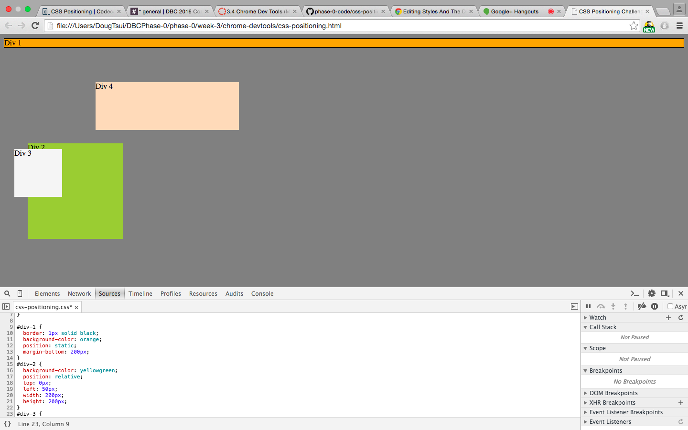
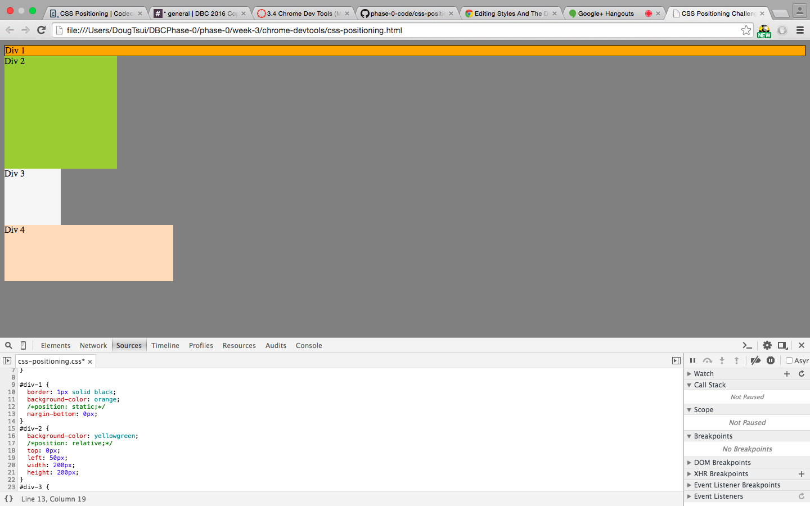
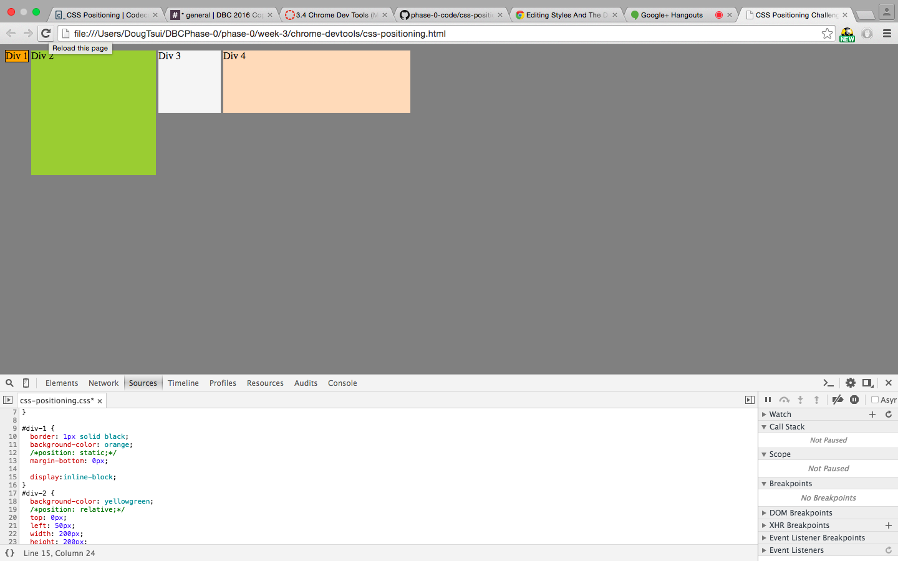
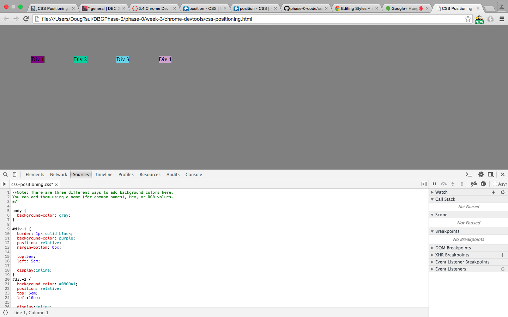
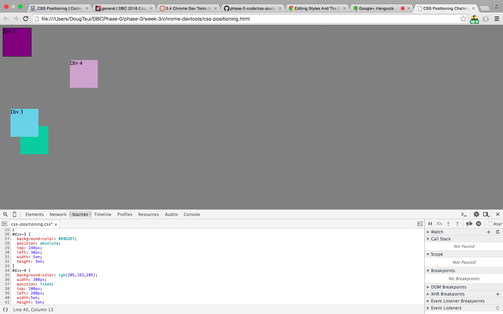
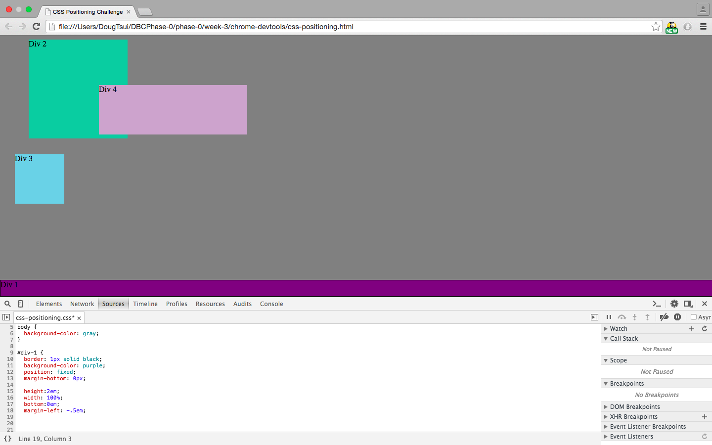
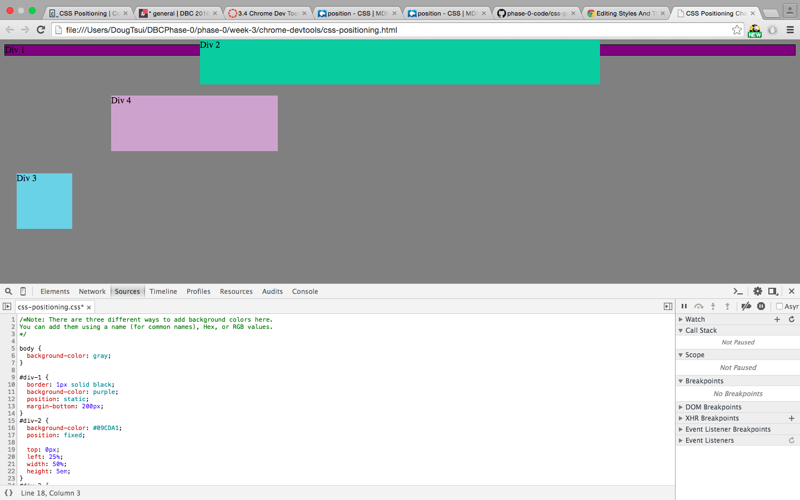
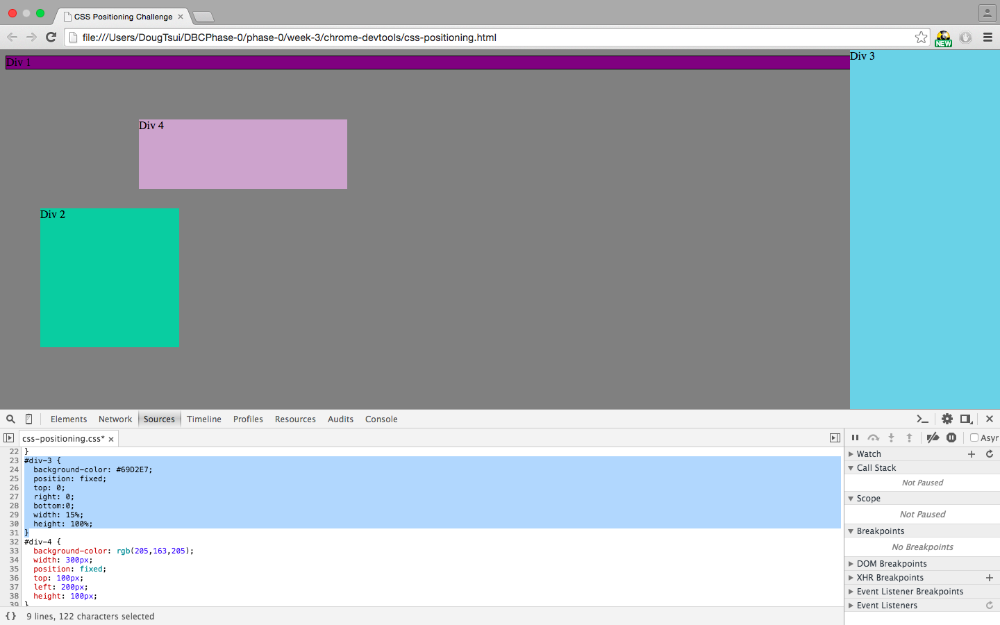
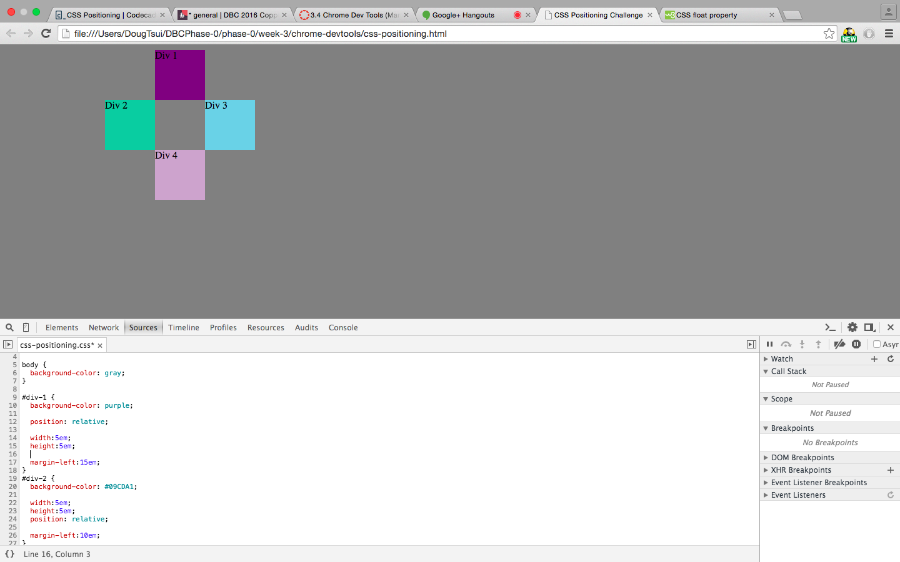

How can you use Chrome's DevTools inspector to help you format or position elements?

Visually it helps me a lot, because the changes that I make on the code are instantly displayed live on the screen.So it is really easy to fiddle around and intutively figure out what each line of code does.

How can you resize elements on the DOM using CSS?
Hmm, I'm not sure if I understand this question completely. From my understanding DOM gives a visual display of how your elements are interconnected. It takes the form of a tree and shows parent-child relationships between elements. As for resizing with CSS, there's always a margin, border, padding, and content to each element. You determine how much space you want the margin, border, padding, and content to take by your code.

What are the differences between Absolute, Fixed, Static, and Relative positioning? Which did you find easiest to use? Which was most difficult?

Absolute: Sets an element in the exact place you command it to be set. The position value are relevant to the parent element if there is a parent element.

Fixed: Position is always relative to the viewer. If the viewer scrolls around the page, the element will always follow the viewer.

Static: It is the default state of an element. It doesn't care about positioning.

Relative: Setting an element to relative means setting a position relative to itself. So the element will show up
on the page where it is normally suppose to be, until you set it's position with top,left,bottom,right. Once you add that, the element will position itself relative to where it was suppose to be.

What are the differences between Margin, Border, and Padding?

The innermost layer is the content which is surrounded by padding. Padding is surrounded by border. Border is surrounded by margin. Margin is transparent whereas border and padding are not. (Edit: Padding may be trasparent as well? Can anyone confirm?)

What was your impression of this challenge overall? (love, hate, and why?)
Neither loved it or hated it. I find html/css to be both annoying and boring. But that doesn't mean I hate it, just a general dislike. As for the challenge, overall I think it's pretty useful. It lets you tinker with some the basic css elements that we learned this week, and I enjoyed the practice.

3.4 Exercise 1

3.4 Exercise 2

3.4 Exercise 3

3.4 Exercise 4

3.4 Exercise 5

3.4 Exercise 6

3.4 Exercise 7

3.4 Exercise 8

3.4 Exercise 9
